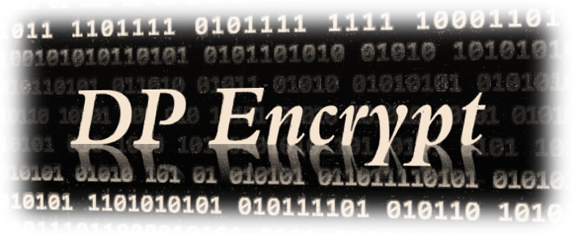

# DP Encrypt

## DP Encrypt 란

### DP(Decrypt-format Preserving) - 복호화 형태 보존

- 일반적으로 암호문(cyphertext)을 잘못된 key로 복호화 하면, 알아볼 수 없는 이상한 문자열이 나와 복호화가 실패 했음을 인지할 수 있습니다.
- *DP Encrypt*는 잘못된 key로 복호화 하더라도, 평문(plaintext)과 같은 형식을 유지해 줌으로서 복호화 실패 여부를 알 수 없습니다.
  - 복호화 실패 여부를 판단할 수 없기 때문에 [사전 공격(Dictionary attack)](https://ko.wikipedia.org/wiki/사전_공격)을 예방할 수 있습니다.

### Variable cyphertext - 가변적 암호문

- 일반적으로 같은 평문과 key로 생성된 암호문은 같은 값을 가집니다.
- *DP Encrypt*는 암호문 생성 로직에 난수 요소가 포함되어 있어 같은 평문과 key를 사용하더라도 매번 다른 값을 가집니다.
  - 생성된 암호문의 값이 다르기 때문에 암호문을 비교해서 추가 정보를 얻는 것을 예방할 수 있습니다.

---

### 프로젝트 목적 및 용도

- 서비스 개발자 조차 내용을 확인 할 수 없게 스크립트 단에서 암호화.
  - 다소 민감한 정보 저장 목적
- 전체 소스가 공개되는 *javascript*의 특성을 고려해서 보안 강화 고려.
  - 복호화 형식 보존: 암호문을 복호화 할때 잘못된 key(password)를 입력 하더라도 평문의 형식을 유지, 복호화 성공여부 인지 차단.
  - 가변적 암호문: 같은 정보로 암호화 하더라도 생성된 암호문이 달라 암호문을 이용한 비교 분석 차단.

### 프로젝트를 시작하는 방법

- 샘플 페이지: <https://pnumag.github.io/dp-encrypt/>
- 스크립트 파일로드.

  ~~~ HTML
  
  ~~~

  - 싱글톤으로 구현되어 있어 스크립트 로드 후 바로 사용 가능합니다.

- 암호화

  ~~~ javascript
    var plaintext = '38465729';
    var password = 'some_password';
    var cipher_1 = dpEncript.encrypt(plaintext, password);
    var cipher_2 = dpEncript.encrypt(plaintext, password);
    console.log(cipher_1);  // ZjU3MGMwYTFlZmIxMzU0MTc4MTJjYzU1MWY1N2E0ZWM=
    console.log(cipher_2);  // M2QxNzIwZDMxMDkwYTFiMzExM2IzYjYwMGQ4YjRiYzc=
  ~~~

  - 평문은 8자리 숫자를 사용하며, 부족한 부분은 *0*으로 채워지고, 넘어가는 부분은 무시됩니다.
    - ex) 1234 -> 00001234
    - ex) 123456789 -> 23456789
  - *password*는 특별한 양식 없이 사용하시면 됩니다.
  - 암호문은 BASE64 인코딩 되어 리턴됩니다.
  - 같은 정보를 이용해서 암호화해도 결과가 다릅니다.
    - 암호문을 이용한 정보 비교가 불가능합니다.

- 복호화

  ~~~ javascript
    var plain_1 = dpEncript.decrypt(cipher_1, password);
    var plain_2 = dpEncript.decrypt(cipher_2, password);
    var plain_3 = dpEncript.decrypt(cipher_1, 'wrong');
    console.log(plain_1);  // 38465729
    console.log(plain_2);  // 38465729
    console.log(plain_3);  // 92707582
  ~~~

  - 암호문 값이 다르더라도 같은 정보로 암호화 했다면 같은 결과를 리턴합니다.
  - 잘못된 *password*를 이용해서 복호화 하더라도 원본과 같은 형태(8 자리 숫자)를 리턴합니다. (**Decrypt-format Preserving**)

### 라이선스 정보

- Apache License 2.0

### 외부 리소스 정보

- KISA의 LEA
  - *LEA 암호 알고리즘*을 기반으로 구현했습니다. (※ 참조: [블록암호 LEA 규격서](https://seed.kisa.or.kr/html/egovframework/iwt/ds/ko/ref/LEA%20A%20128-Bit%20Block%20Cipher%20Datasheets-Korean.pdf))
  - URL: https://seed.kisa.or.kr/iwt/ko/sup/EgovLeaInfo.do
